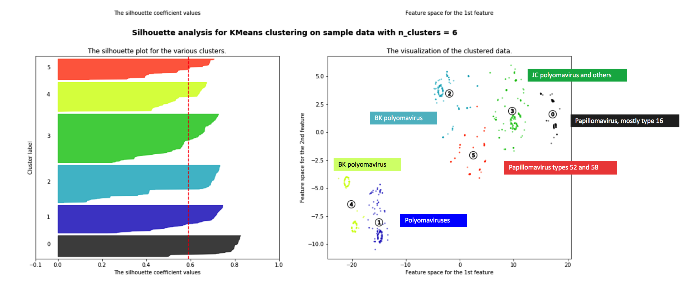
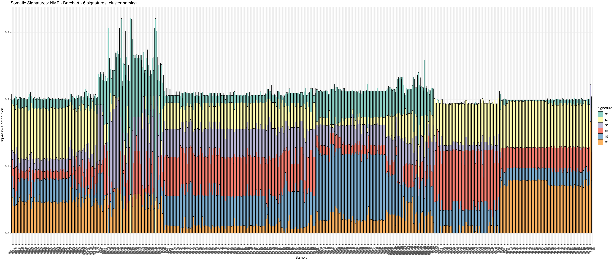

# NEDS
Nucleotide Enrichment / Depletion Signatures

* Project still under development 🤖 *

NEDS is a machine learning model that parses input genomes on single nucleotide enrichment/depletion values in a trinucleotide context (i.e. A[C>G]T = ACT -> AGT). NEDS clusters on signatures of enrichment/depletion, and with the integration of mutational signature and differentail gene expression tools, provides signature visualisation and differential analysis between unique signature clusters.The application of NEDS is two-fold, providing prediction to evolutionary mechanisms driving genome differentiation as well as highly accurate reference-free taxonomic classification.

