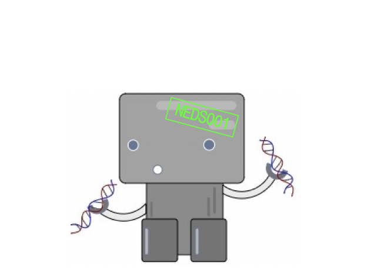

# NEDS
Nucleotide Enrichment / Depletion Signatures

*** Project still very much under development 🤖 ***

NEDS is a machine learning model that parses input genomes on single nucleotide enrichment/depletion values in a trinucleotide context (i.e. A[C>G]T = ACT -> AGT). NEDS clusters on signatures of enrichment/depletion, and with the integration of mutational signature and differentail gene expression tools, provides signature visualisation and differential analysis between unique signature clusters.The application of NEDS is two-fold, providing prediction to evolutionary mechanisms driving genome differentiation as well as highly accurate reference-free taxonomic classification.

Viral genomes have high rates of mutation, resulting in rapid evolution needed to evade the host immune system. Previous work has shown that some viruses show scars of specific mutations processes contributing to the nucleotide composition of the viral genome, but the extent of the number of processes that shape genome composition is unknown. The extreme diversity of viral genomes even belonging to the same genera generated by these processes often leads to challenges in defining taxonomy and evolutionary relationships.

Analysis of NEDS clustering on di- and tri-nucleotide motif enrichment scores reveals that genome composition was highly correlative with the taxonomic classification of the input viruses indicating unique combinations of evolutionary processes acting on distinct viral genome families.  Such processes were investigated with analysis of trends in nucleotide enrichment and depletion, resulting in a predictive six signatures of genome composition present within our dataset.

I'm working on methodology to accurately map NEDS signatures to known biological processes (mutational signatures) that are significant in evolution, mutation, and oncogenesis.

